# Step-Up India

**Step-Up India** is a full-stack web application designed to bridge the gap between education and employability. It provides students with access to courses, internships, certificates, and personalized dashboards to track their progress.

---

## 🎯 Project Overview
The platform empowers students by:
- Offering structured **courses** to build skills.
- Providing **internship opportunities** to gain real-world experience.
- Generating **certificates** upon completion to validate learning.
- Delivering a **personalized dashboard** for tracking progress and achievements.

This project demonstrates both **frontend development** (HTML, CSS, JavaScript) and **backend engineering** (Node.js, Express.js, MySQL), showcasing a complete end-to-end solution.

---

## 🚀 Features
- **Student Registration & Login**: Secure authentication system.  
- **Dashboard**: Personalized view of courses, progress, and certificates.  
- **Courses & Internships**: Listings with structured information.  
- **Progress Tracking**: Visual representation of learning journey.  
- **Certificate Generation**: Automated certificate creation upon completion.  

---

## 🛠️ Tech Stack
- **Frontend**: HTML, CSS, JavaScript  
- **Backend**: Node.js, Express.js  
- **Database**: MySQL  
- **API Testing**: Postman  

---

## 📸 Screenshots

### Home Page

### Registration Page
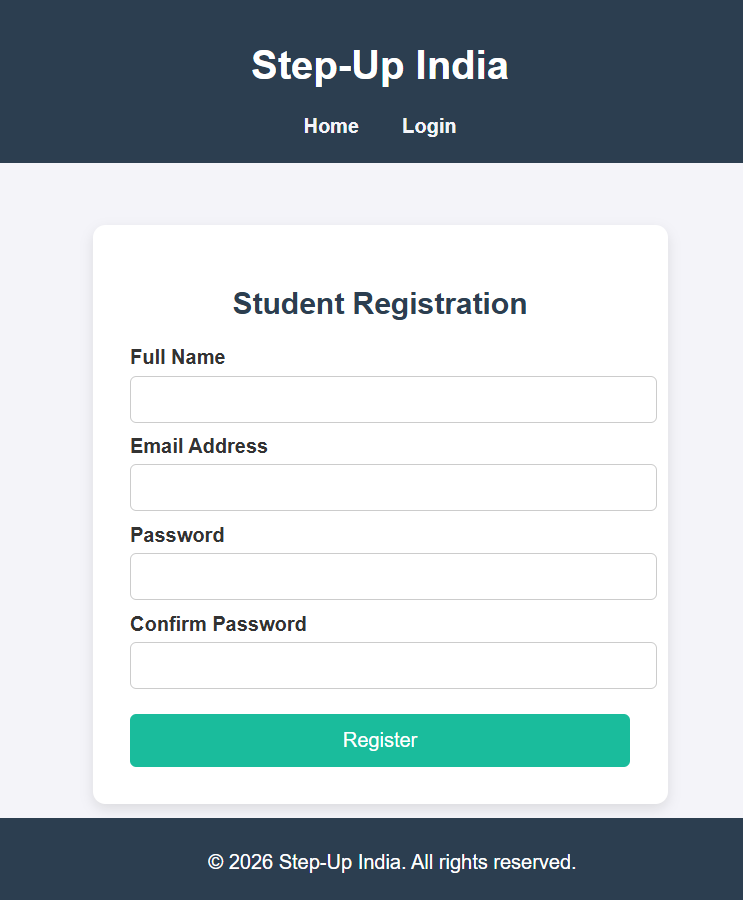

### Login Page
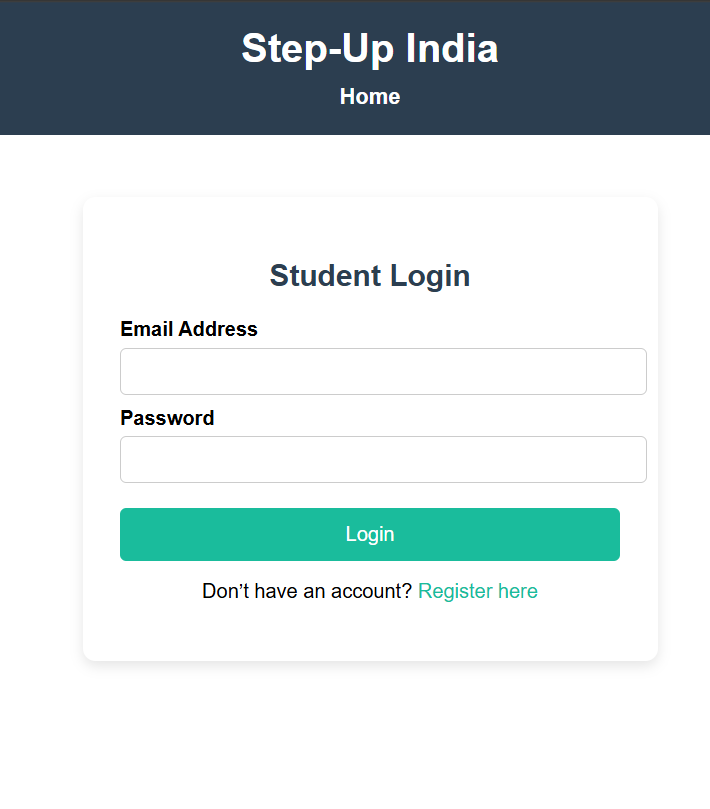

### Dashboard
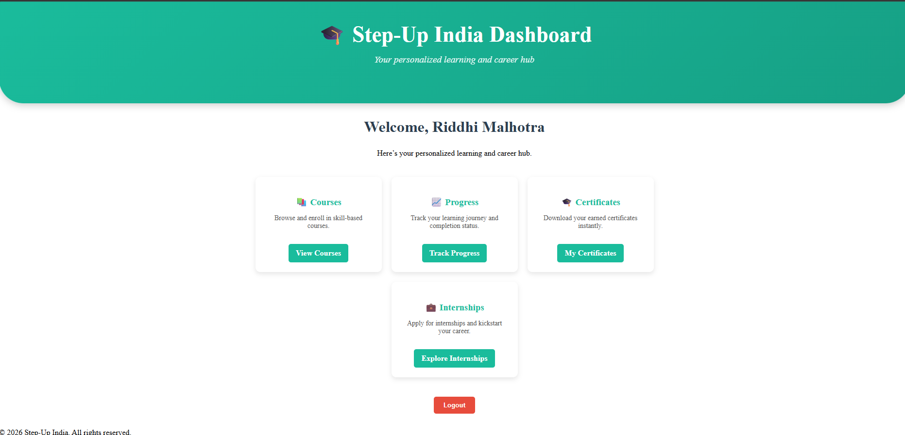

### Courses
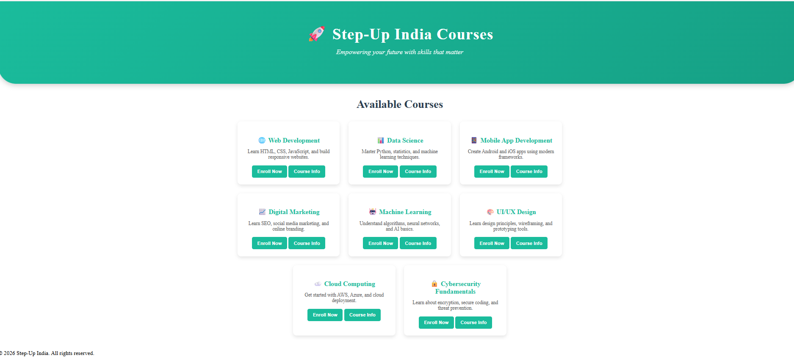

### Course List
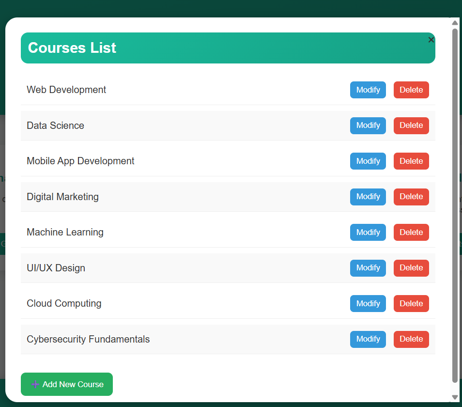

### About Course
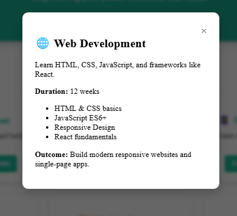

### Enroll Form
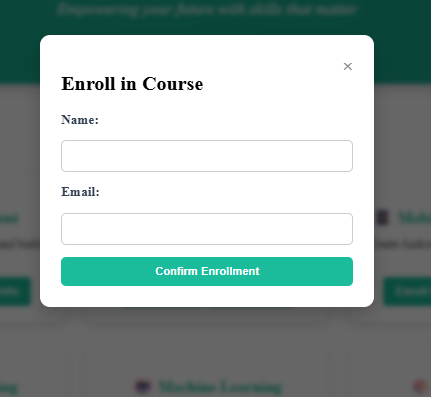

### Progress Tracker
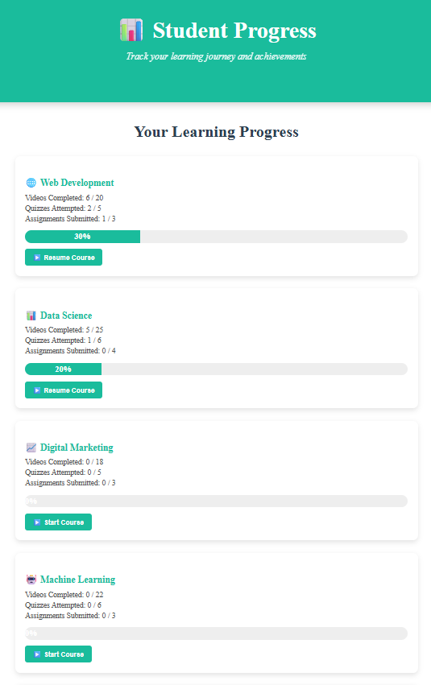

### Certificate
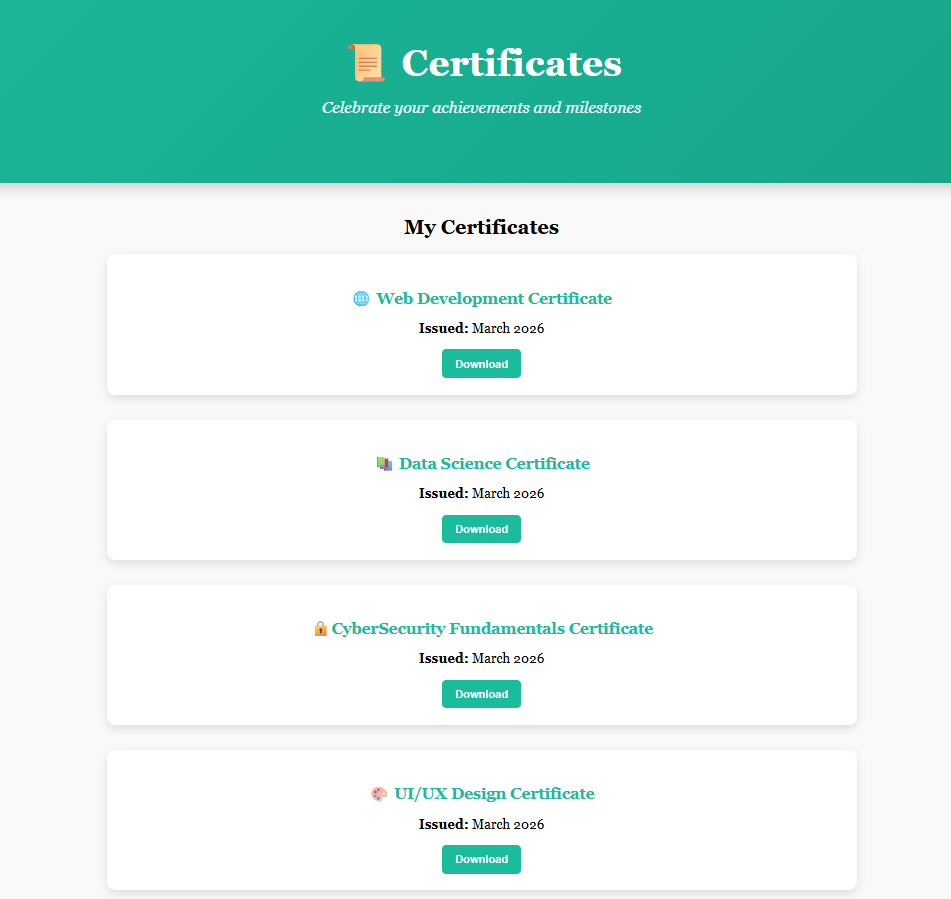

### Example Certificate
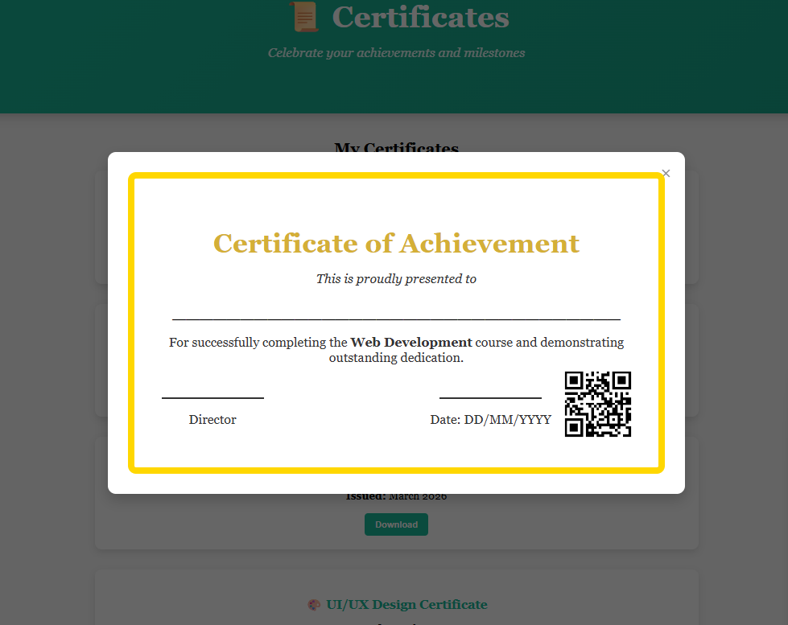

### Internships
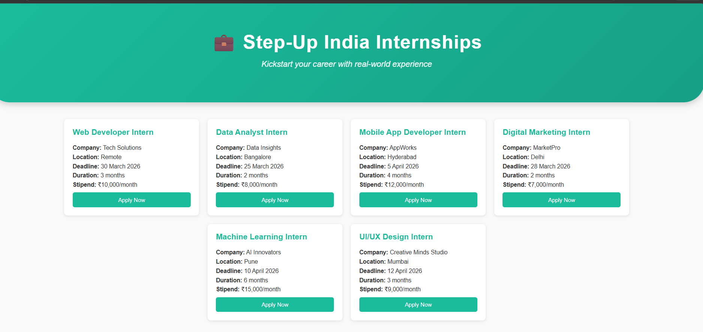

### Internship List
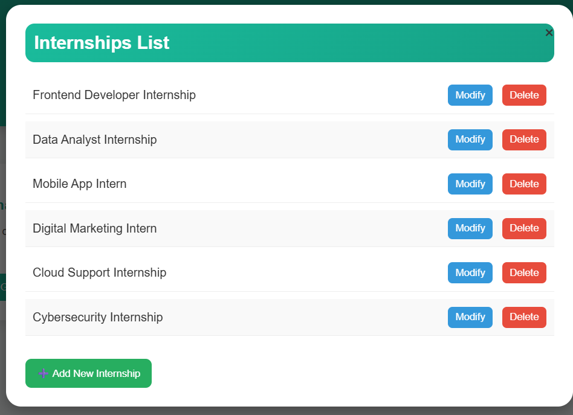

### Internship Application
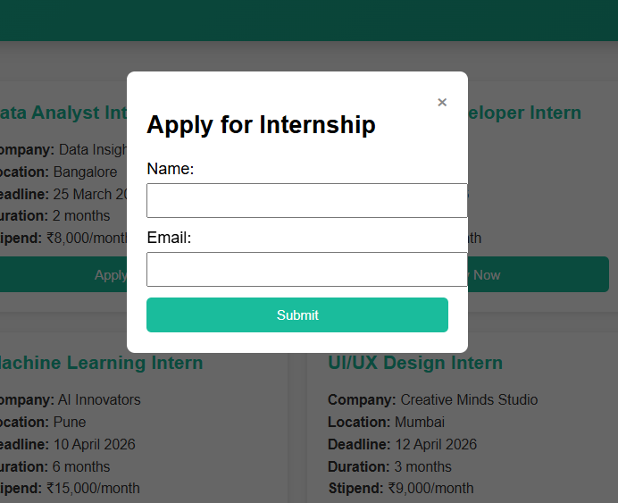

### Admin Panel
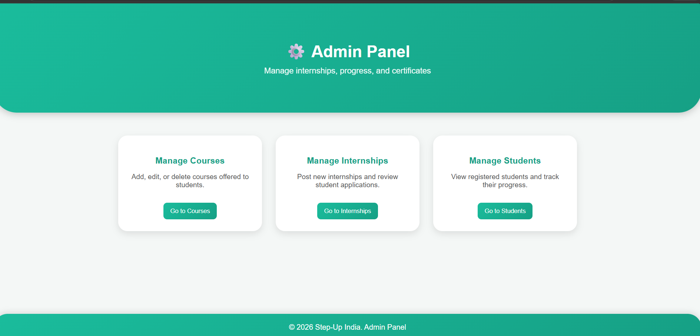

### User List
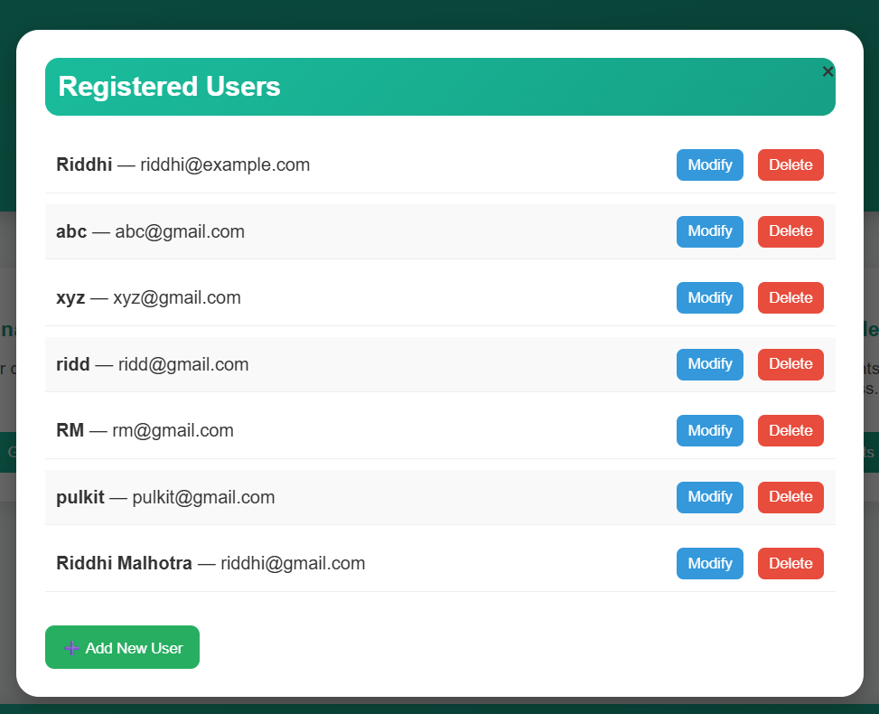

---

## ▶️ How to Run
1. **Clone or download** the repository.  
2. **Frontend**: Open the `HTML` folder and run `index.html` in a browser.  
3. **Backend**:  
   - Navigate to the `step up india` folder.  
   - Run `npm install` to install dependencies.  
   - Start the server with `node app.js`.  
   - Ensure MySQL is running and configured with the provided schema.  

---

## 📌 Future Enhancements
- Add role-based access (admin vs student).  
- Integrate payment gateway for premium courses.  
- Deploy on cloud (Heroku/AWS) for public access.  

---

## 👩‍💻 Author
Developed by **Riddhi Malhotra**  
